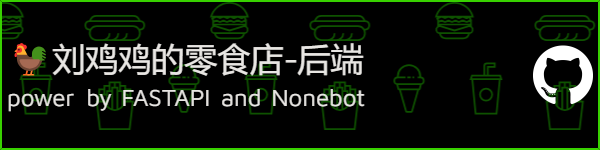

# What is this?

拟计划将这个后端对接到Nonebot，实现顾客一点单，QQ机器人就会发消息提醒。

# Based on what?

-   ⭐  FastAPI
-   ⭐  SQLModel
-   ⭐  Nonebot

# How to use?

```bash
$ pip install -r requirements.txt
$ uvicorn main:app
```